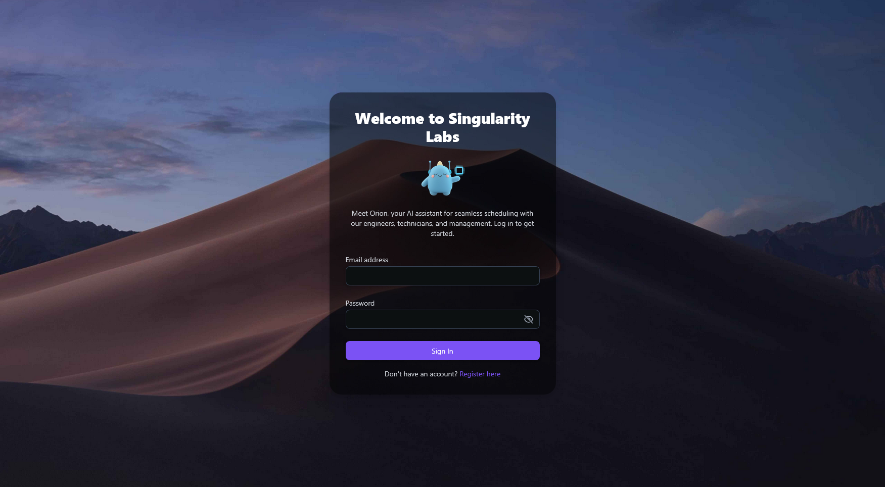
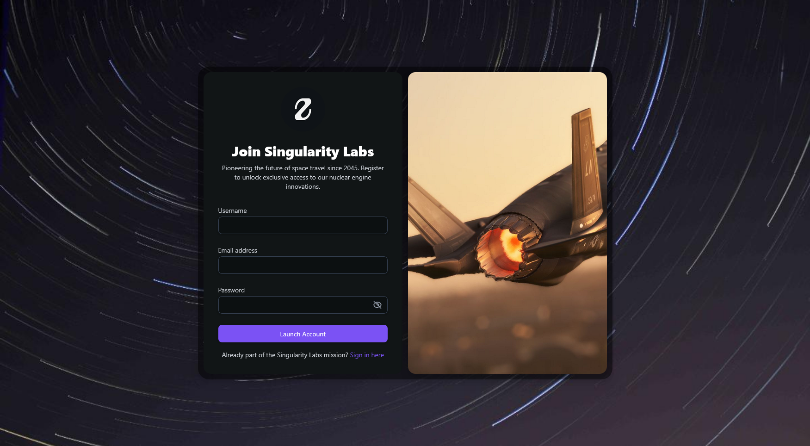
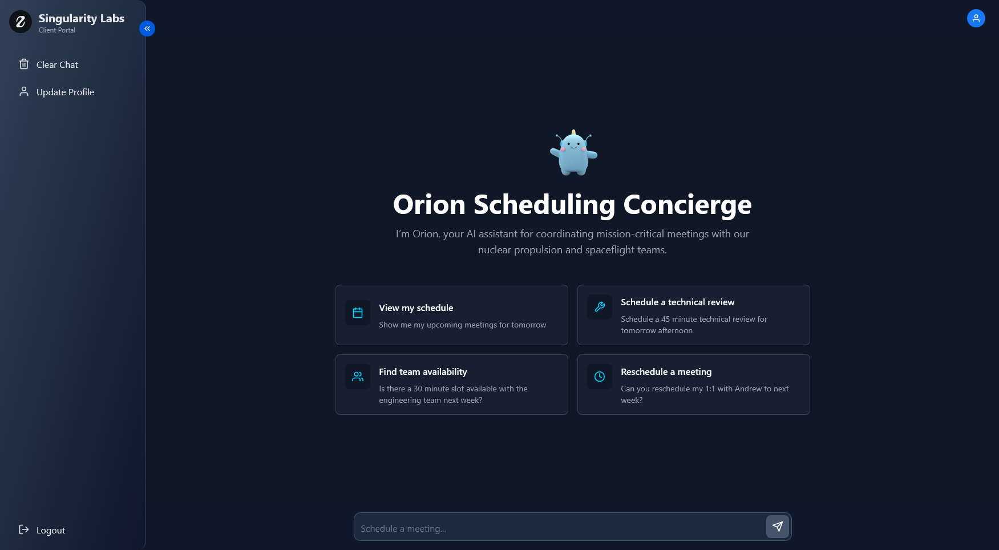
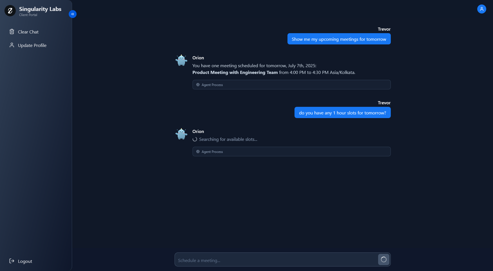
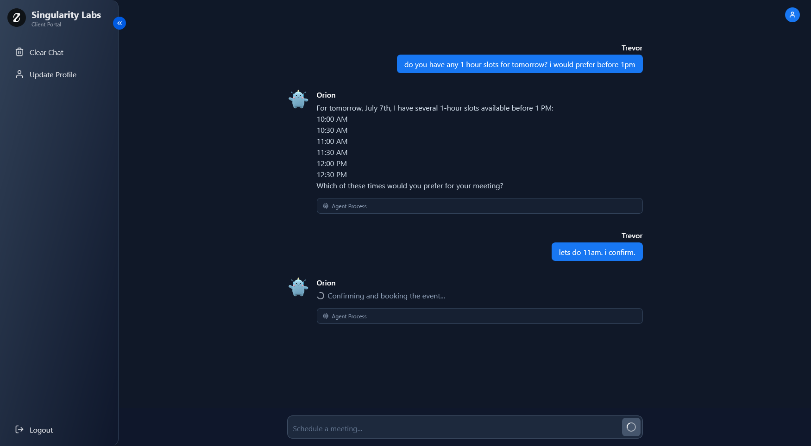
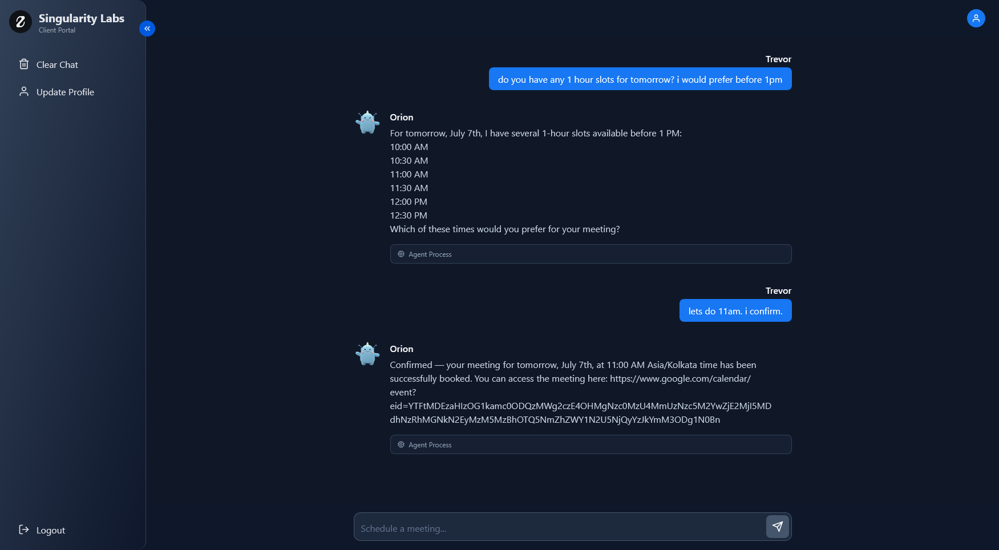
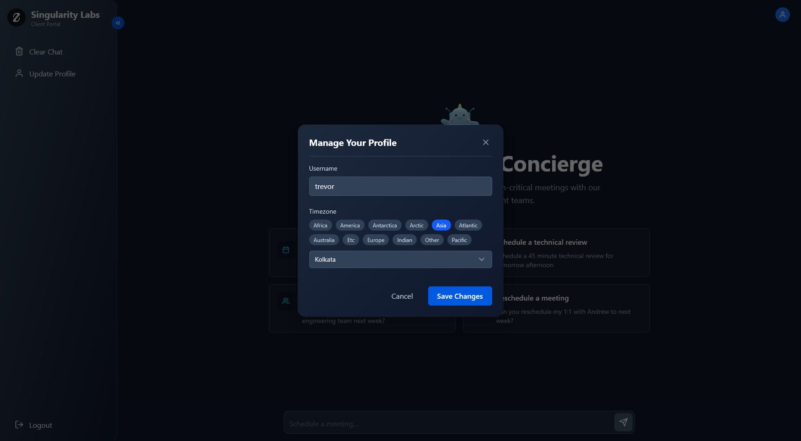
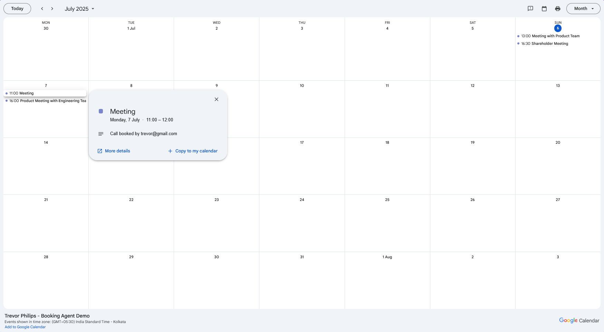

# Singularity Labs — AI Scheduling Concierge (Frontend)


An AI-powered conversational scheduling assistant for a fictional company — **Singularity Labs** — enabling natural-language booking, conflict resolution, and seamless Google Calendar integration.

---

## 🚀 Live Demo

👉 **Try it here:** [singularitylabs.netlify.app](https://singularitylabs.netlify.app)  
**Note:** The backend is hosted on a free-tier service; the first request may take up to 30 seconds to wake the server.

---

## ✨ Key Features

✅ **Modern React (TypeScript) Frontend** — responsive, real-time chat UI.  
✅ **JWT Auth & Profile Management** — register, log in, update profile.  
✅ **Natural Language Booking Flow** — find, confirm, or reschedule slots.  
✅ **Timezone Awareness** — auto-detects user timezone, displays local times.  
✅ **Google Calendar Integration** — bookings sync live with a shared team calendar.  
✅ **Secure API Communication** — talks to a robust FastAPI backend with concurrency handling.

---

## 🖼️ Screenshots

A glimpse of the end-to-end user journey:

### 👤 Login


### 📝 Register


### 👋 Welcome Screen


### 🔍 Find Available Slots


### ✅ Confirm Booking


### 📆 Booking Confirmed


### ⚙️ Update Profile


### 📅 Synced Google Calendar
 

👉 **Public calendar link:** [View live bookings](https://calendar.google.com/calendar/embed?src=7743582e37793f0f1622907a74a0cd7a233930a9496faef57e9642c2dbc78857%40group.calendar.google.com&ctz=Asia%2FKolkata).

---

## 🗂️ Tech Stack

| **Tech**     | **Purpose**                                   |
|--------------|-----------------------------------------------|
| React + TypeScript | Modern frontend framework & static typing  |
| Vite         | Fast dev server and build tooling             |
| Tailwind CSS (optional) | Styling (mention if you used it)     |
| Axios/Fetch  | API calls to FastAPI backend                  |
| JWT Storage  | Secure auth state handling                    |
| Netlify      | Hosting and CI/CD for frontend                |

---

## ⚙️ Running Locally

### Prerequisites

- Node.js (v18+ recommended)
- Backend API running locally or hosted

### 1️⃣ Clone the repo

```bash
git clone https://github.com/purushothdl/singularity-scheduler-frontend.git
cd singularity-scheduler-frontend
```

### 2️⃣ Install dependencies

```bash
npm install
```

### 3️⃣ Configure environment variables

Create a `.env` file in the root directory and add the following variables (replace with your actual values):

```env
VITE_API_BASE_URL=http://localhost:8000  # Replace with your backend API URL
```

### 4️⃣ Start the development server

```bash
npm run dev
```

The app will be available at `http://localhost:5173`.

---

## 🧩 Project Structure

```bash
src/
 ├── api/           # API service files (e.g., authService.ts, chatService.ts)
 ├── assets/        # Static assets (images, icons, backgrounds)
 ├── components/    # Reusable React components
 │   ├── auth/      # Auth-related components
 │   ├── chat/      # Chat-related components
 │   ├── common/    # Common UI components
 │   ├── layout/    # Layout components
 │   └── ui/        # Base UI components (e.g., Button, Input)
 ├── context/       # Context providers (e.g., AuthContext)
 ├── hooks/         # Custom React hooks
 ├── lib/           # Library utilities (e.g., axios.ts)
 ├── pages/         # Page-level components
 ├── types/         # TypeScript type definitions
 ├── utils/         # Utility functions
 ├── App.tsx        # Main application component
 └── main.tsx       # Vite entry point
```

---

## 🛠️ Scripts

| Command         | Description                                  |
|-----------------|----------------------------------------------|
| `npm run dev`   | Starts the development server (Vite).        |
| `npm run build` | Builds the app for production.               |
| `npm run lint`  | Runs ESLint to check for code issues.        |
| `npm run preview` | Previews the production build locally.     |

---

## 🤝 Backend Integration

This frontend communicates with a robust **FastAPI backend**:

* Handles JWT authentication & user data
* Provides booking slots & manages concurrency
* Syncs bookings with Google Calendar

👉 Check out the [Backend Repo](https://github.com/purushothdl/singularity-scheduler-backend.git) for details.

---

## 🔮 Future Improvements

* **Persistent Chat History:** Save and restore user conversations.
* **Multi-User Calendars:** Allow each team member to manage their own availability.
* **Better UI Polish:** Add animations and improved state handling.
* **Comprehensive E2E Tests:** Cypress or Playwright for user flow testing.

---

> **Note:** *Singularity Labs is a fictional company name used for this project.*

---

## 🙏 Acknowledgments

- [FastAPI](https://fastapi.tiangolo.com/) for the robust backend.
- [Vite](https://vitejs.dev/) for the lightning-fast development experience.
- [Netlify](https://www.netlify.com/) for seamless deployment.

---

